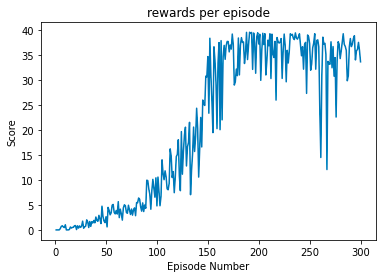

# Project Report
---
This project utilised the DDPG (Deep Deterministic Policy Gradient) architecture.

## State and Action Spaces
In this environment, a double-jointed arm can move to target locations. A reward of +0.1 is provided for each step that the agent's hand is in the goal location. Thus, the goal of your agent is to maintain its position at the target location for as many time steps as possible.

The observation space consists of 33 variables corresponding to position, rotation, velocity, and angular velocities of the arm. Each action is a vector with four numbers, corresponding to torque applicable to two joints. Every entry in the action vector must be a number between -1 and 1.

## Learning Algorithm

The agent training utilised the DDGP Algorithm in the Continuous_Control.ipynb notebook.

It continues episodical training via the ddpg agent until max episods are reached or until the environment is solved. The  environment is considered solved when the average reward (over the last 100 episodes) is at least +30.0. 

Each episode continues until `max_t` time-steps is reached or until the environment says it's done.

As above, a reward of +0.1 is provided for each step that the agent's hand is in the goal location.

The DDPG agent is inside the ddpg_agent.py.

For each time step and agent the Agent acts upon the state utilising a shared (at class level) `replay_buffer`, `actor_local`, `actor_target`, `actor_optimizer`, `critic_local`, `criticl_target` and `critic_optimizer` networks.

### DDPG Hyper-Parameters
- numbe of episodes (int): maximum number of training episodes : 500
- max_t (int): maximum number of timesteps per episode : 1000
- num_agents: number of agents in the environment : 1

### DDPG Agent Hyper-Parameters

- BUFFER_SIZE (int): int(1e5)
- BATCH_SIZ (int): 128
- GAMMA (float): 0.99
- TAU (float): 1e-3 
- LR_ACTOR (float): 2e-4  
- LR_CRITIC (float):  2e-4   
- WEIGHT_DECAY (float): 0

### DDPG Model Hyper-Parameters:
- fc1_units : 128
- fc2_units : 128

### Neural Networks

Actor and Critic network models were defined in [`ddpg_model.py`](https://github.com/hortovanyi/DRLND-Continuous-Control/blob/master/ddpg_model.py).

The Actor networks utilised two fully connected layers with 256 and 128 units with relu activation and tanh activation for the action space. The network has an initial dimension the same as the state size.

The Critic networks utilised two fully connected layers with 256 and 128 units with leaky_relu activation. The critic network has  an initial dimension the size of the state size plus action size.

## Plot of rewards


```
Episode 100	Average Score: 3.00	Score: 4.81
Episode 200	Average Score: 24.89	Score: 37.27
Environment solved in 300 episodes with an Average Score of 35.33
```

### Future Enhancement
Ideas from following papers can be implemented.
  - Trust Region Policy Optimization (TRPO)
  - Truncated Natural Policy Gradient (TNPG)
  - Proximal Policy Optimization (PPO)
  - Distributed Distributional Deterministic Policy Gradients (D4PG)